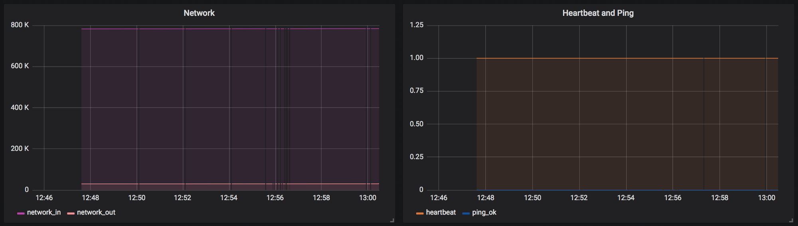

# Collecting and Handling Metrics in Sensu: Check output metric extraction w/ InfluxDB & Grafana

Sensu is an extremely powerful standalone monitoring framework. But the real
beauty of Sensu lies in its ability to harmoniously interact with, support, and
instrument other tools to create a customized and complete monitoring solution.
Take metrics for example, Sensu offers multiple mechanisms to monitor
performance metrics such as check output metric extraction and StatsD. On its
own, thats pretty cool, but combined with its robust event pipeline, you can
cater different methods of metric analysis to your specific needs.

                       

        *Raise the roof, 'cause your monitoring is all under one roof.*

I'm going to walk you through just one of the endless permutations of metrics
software you can pair with Sensu:
1. **Collect** using [Sensu check output metric extraction][1]
2. **Transform** with a [Sensu InfluxDB Handler][2]
3. **Record** in an [InfluxDB time series database][3]
4. **Visualize** on a [Grafana dashboard][4]

This guide assumes you have Sensu 2.x installed, if you don't already, please
see [Installation and Configuration][5].

## Collecting Metrics
To collect metrics using Sensu check output metric extraction, you'll first need
to spin up a backend, agent, and cli.

Backend:
```
sensu-backend start
```

Agent:
```
sensu-agent start --subscriptions metrics
```

CLI (see [Configuring Sensuctl][6]):
```
sensuctl configure
```

Once you have Sensu running on your selected host(s), you'll want to create a
check and configure it to extract metrics. The script we're using for collection
([metrics-graphite.sh][7]) prints out several metrics in [Graphite Plaintext Format][8].
Sensu supports several other metric formats for extraction, so feel free to
customize your check accordingly, or try out other [example][9] formats.
```
sensuctl check create collect-metrics --command metrics-graphite.sh --interval 1 --subscriptions metrics --output-metric-format graphite_plaintext
```

After the check has executed (this shouldn't take too long) validate that your
metrics have been collected, extracted, and stored within the check's event.
```
sensuctl event info [entity-name] collect-metrics --format json
```

## Transforming Metrics
Now that we have Sensu events from our checks and metrics, we need to handle
them. This little tool I wrote, [sensu-influxdb-handler][2], will transform any
metrics contained in a Sensu event and send them off to a configured InfluxDB.
Make sure you download the handler from [releases][10].
```
sensuctl handler create sensu-influxdb-handler --command "sensu-influxdb-handler --addr http://localhost:8086 --username [username] --password [password] --db-name [db-name]" --type pipe
```

Make sure to assign the handler we just created to the check from the first step.
```
sensuctl check set-output-metric-handlers collect-metrics sensu-influxdb-handler
```

## Record Metrics
You'll also need the InfluxDB daemon running on the above configured address
with the above configured credentials in the above configured database.
```
influxd
```

You can verify that the metrics have been handled and recorded by querying your
InfluxDB.

## Visualize Metrics
Now that the data is in a time series database, lets hook it up to a dashboard.
Start a Grafana server (ensure no port collisions with Sensu) and customize your
dashboard based on the metrics.
```
brew services start grafana
```

You'll need to connect your Grafana dashboard to the InfluxDB datasource, so if
you're unsure of how to do that yet, check out [this guide][11]. You can also
utilize this [dashboard configuration][16] ensuring you add your host name
where you see `[ENTITY NAME]` and configure the datasource as it's defined.





## Test Plan

Think you've got it? Download [resources.json][12] and modify the handler config
with your InfluxDB credentials. Then, you can add all of the resources using
`sensuctl`.
```
sensuctl create -f resources.json
```

From there, you'll have 4 checks ready to run on 4 different subscriptions.
Just spin up an agent with one of the subscriptions to seamlessly switch to
a different metric extraction format. All of these checks should populate the
InfluxDB and Grafana dashboard!
```
sensu-agent start --subscriptions graphite
```

| Check | collect-graphite | collect-influx | collect-nagios | collect-opentsdb |
| ----- | ---------------- | -------------- | -------------- | ---------------- |
| Subscription | `graphite` | `influx` | `nagios` | `opentsdb` |
| Command | [metrics-graphite.sh][7] | [metrics-influx.sh][13] | [metrics-nagios.sh][14] | [metrics-opentsdb.sh][15] |
| Output Metric Format | `graphite_plaintext` | `influxdb_line` | `nagios_perfdata` | `opentsdb_line` |

[1]: https://docs.sensu.io/sensu-core/2.0/guides/extract-metrics-with-checks/
[2]: https://github.com/nikkiki/sensu-influxdb-handler
[3]: https://github.com/influxdata/influxdb
[4]: https://github.com/grafana/grafana/
[5]: https://docs.sensu.io/sensu-core/2.0/getting-started/installation-and-configuration/
[6]: https://docs.sensu.io/sensu-core/2.0/getting-started/configuring-sensuctl/
[7]: https://github.com/nikkiki/sensu-influxdb-handler/blob/master/examples/metrics-graphite.sh
[8]: http://graphite.readthedocs.io/en/latest/feeding-carbon.html
[9]: https://github.com/nikkiki/sensu-influxdb-handler/tree/master/examples
[10]: https://github.com/nikkiki/sensu-influxdb-handler/releases
[11]: http://docs.grafana.org/features/datasources/influxdb/
[12]: resources.json
[13]: https://github.com/nikkiki/sensu-influxdb-handler/blob/master/examples/metrics-influx.sh
[14]: https://github.com/nikkiki/sensu-influxdb-handler/blob/master/examples/metrics-nagios.sh
[15]: https://github.com/nikkiki/sensu-influxdb-handler/blob/master/examples/metrics-opentsdb.sh
[16]: grafana-config.json
